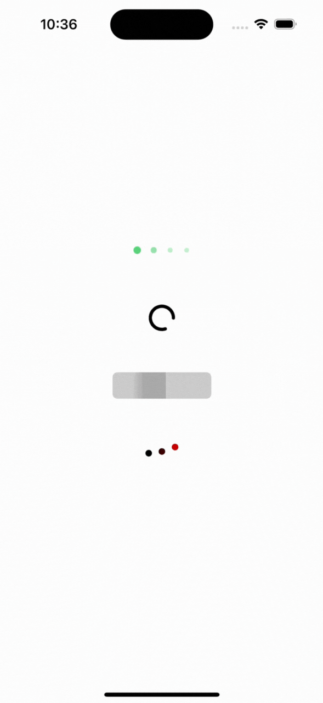

# LoadingViewKit

A customizable, animated loading indicator framework for iOS, written in Swift.  
Built with a clean, extensible **Strategy + Mode** architecture so you can easily add new animations while keeping code organized and maintainable.

## 📷 Preview

<p align="center">
  
</p>

---

## ✨ Features

- Multiple built-in loading animations:
  - **Dots** – Pulsating dots
  - **Ring** – Spinning circular arc
  - **Shimmer** – Animated shimmering bar
  - **Wave** – Dots moving up/down in a wave pattern with optional color transition
- Fully customizable styles for each animation type
- Auto Layout–friendly (`intrinsicContentSize` support)
- Easily extendable with your own modes and strategies
- Designed with **protocol-oriented programming** and **SOLID** principles

---

## 📦 Installation

### Swift Package Manager

Add the package in Xcode:

1. Go to **File > Add Packages...**
2. Enter the repository URL:

```

[https://github.com/emrekr/LoadingViewKit.git](https://github.com/emrekr/LoadingViewKit.git)

````

3. Select the latest version and add it to your target.

---

## 🚀 Usage

### 1. Import the framework

```swift
import LoadingViewKit
````

### 2. Create a loading view with a specific mode

```swift
import LoadingViewKit

// Dots
let dots = LoadingView<DotsMode>()
dots.style.color = .systemGreen
dots.style.count = 4
dots.style.size = 10
dots.startAnimating()

// Ring
let ring = LoadingView<RingMode>()
ring.style.strokeColor = .label
ring.style.lineWidth = 4
ring.style.gapRatio = 0.2
ring.startAnimating()

// Shimmer
let shimmer = LoadingView<ShimmerMode>()
shimmer.style.baseColor = UIColor.label.withAlphaComponent(0.12)
shimmer.style.highlightColor = UIColor.label.withAlphaComponent(0.28)
shimmer.style.widthRatio = 0.22
shimmer.startAnimating()

// Wave (sequential up/down with optional color transition)
let waveView = LoadingView<WaveDotsMode>()
waveView.style.color = .black
waveView.style.secondaryColor = .red
waveView.style.count = 3
waveView.style.amplitude = 10
waveView.startAnimating()
```

---

## 🛠 Architecture Overview

This framework is built on two main concepts:

### **Strategy**

* Defines how a specific animation is drawn, laid out, and animated.
* Example: `StrategyDots`, `StrategyRing`, `StrategyShimmer`, `StrategyWave`

```swift
protocol Strategy: AnyObject {
    associatedtype Style
    func hostLayer(in view: UIView) -> CALayer
    func build(in view: UIView)
    func layout(in view: UIView)
    func makeAnimation(in view: UIView) -> CAAnimation
    func apply(style: Style)
}
```

---

### **Mode**

* Binds a strategy to default style values and intrinsic sizing logic.
* Example: `DotsMode`, `RingMode`, `ShimmerMode`, `WaveMode`

```swift
protocol LoadingMode {
    associatedtype S: Strategy
    static func makeStrategy() -> S
    static var defaultStyle: S.Style { get }
    static func intrinsicContentSize(for style: S.Style) -> CGSize
}
```

---

## 🧩 Adding Your Own Animation

To add a new animation:

1. **Create a new `Strategy`** that handles drawing, layout, and animation.
2. **Create a `Mode`** that returns your strategy and default style.
3. Use it via `LoadingView<YourMode>`.

---

## 📄 License

This project is licensed under the MIT License – see the [LICENSE](LICENSE) file for details.

---
